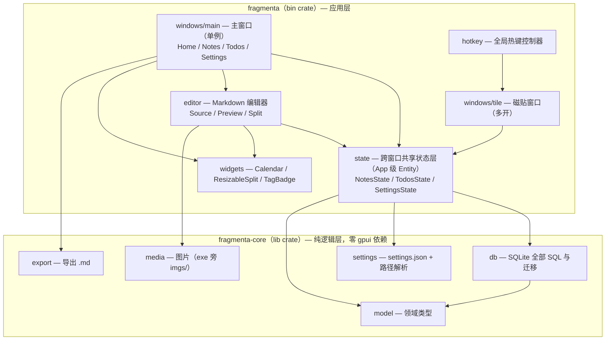
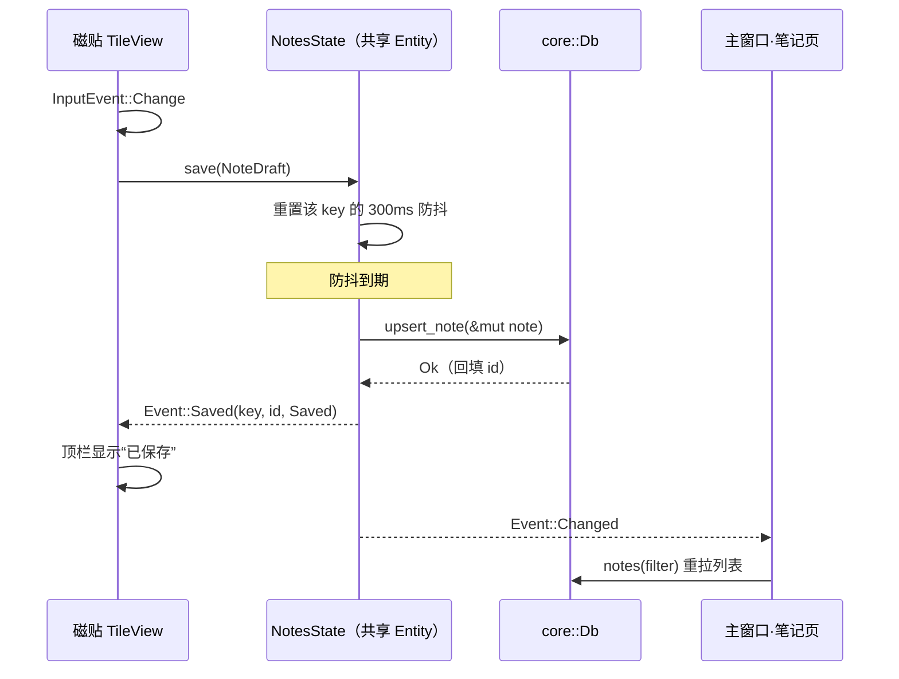

# Fragmenta 架构设计

> 状态：定案（2026-10-05；2026-10-06 spike 结论回写）
> 技术基线：Rust (edition 2024) · gpui-kit 0.7.1 · rusqlite 0.40 (bundled) · global-hotkey 0.8 · Windows 10/11
> 形态：单进程多窗口桌面应用，无后台服务，轻量低内存
> 术语：以根目录 `GLOSSARY.md` 为准（笔记 / 磁贴（速记窗口）/ 待办 / 分类 / 标签）

## 1. 产品概述

### 磁贴（速记窗口）

全局热键呼出，触发一次新开一个，旧窗口保留。无边框置顶小窗（PopUp）：

- 顶栏：新增磁贴 / 设置（Icon 按钮）— 保存状态（中间，兼拖拽区）— 置顶 / 关闭（Icon 按钮）
- 下方：标题输入区 + 正文输入区，正文左下角实时字数统计
- 输入防抖自动保存

### 管理主窗口（单例）

左侧可收缩导航栏（首页 / 笔记 / 待办 / 设置）：

- **首页**：月历（存在笔记或待办的日期有视觉指示，指示样式从候选方案中人工挑选）+ 选中日期的待办列表（可 Check）；首页定位为浏览 + 勾选，唯一写操作是待办 Check，新增 / 编辑 / 删除都在各自页面完成
- **笔记**：两栏布局、分界线可拖动
  - 左栏：搜索筛选（标题 / 全文 / 分类 / 标签）+ 笔记卡片列表（标题、创建时间、摘要、分类、标签最多 3 个；右键菜单设置分类与标签，分类唯一、标签可多；卡片右端垃圾桶图标删除，带确认）
  - 右栏：Markdown 编辑器（Source / Preview / Split 三模式），支持图片
- **待办**：待办项完整增删改
- **设置**：主题、字号、数据存储路径、数据迁移、导出 md、磁贴呼出热键、显式退出（spike ⑤ 定案：`QuitMode::Explicit` 全窗口关闭进程驻留，退出按钮前置 `flush_all` 后 `cx.quit()` 完全退出）

### 数据

- **笔记**：来源为磁贴与主界面两处
- **待办**：仅来源于主界面"待办"页
- SQLite 持久化，默认位于 exe 同级 `data/` 目录

## 2. 总体分层



两条铁律，强制力分级：

1. **`fragmenta-core` 零 gpui 依赖**——编译器强制（Cargo 依赖图）：模块全部依赖注入、无全局静态，数据逻辑可脱离 UI 框架编译与测试；
2. **UI 层不出现 SQL**——封装 + 约定强制：state 层私有持有 `Arc<Db>`、不提供 getter，页面只能调用 state 的行为方法；页面代码禁止 import `fragmenta_core::db`。

## 3. Workspace 结构

```text
Fragmenta/
  Cargo.toml                  # [workspace] members = ["crates/*"]
  crates/
    fragmenta-core/           # 纯逻辑层（零 gpui 依赖）
      Cargo.toml              # rusqlite（含 backup feature）/ serde / serde_json / chrono / sha2 / thiserror
      src/
        lib.rs
        model/                # note.rs / todo.rs / filter.rs
        db/                   # mod.rs（门面）/ migrate.rs / notes.rs / todos.rs / taxonomy.rs
        settings.rs
        media.rs
        export.rs
    fragmenta/                # 应用层（bin）
      Cargo.toml              # gpui-kit / global-hotkey / raw-window-handle / fragmenta-core / windows-sys
      src/
        main.rs               # 仅调 app::run()
        app.rs                # 启动编排：assets / theme / stores / hotkey / windows
        state/                # notes.rs / todos.rs / settings.rs
        hotkey.rs
        editor/               # markdown 编辑器（源文本输入组件 + 三模式组装 + 图片粘贴）
        widgets/              # calendar.rs / resizable_split.rs / tag_badge.rs
        windows/
          main/               # mod.rs（shell+路由）/ home.rs / notes/ / todos.rs / settings.rs
          tile/               # 磁贴
  （运行时产物位于 exe 同级：settings.json、data/fragmenta.db、imgs/；开发期在 target/debug/ 下）
```

state 层不独立成 crate：它依赖 gpui，且消费者只有 app 一个，crate 边界划在 core / app 之间即可。

## 4. 核心设计决策

- **D1 双 crate workspace**：`fragmenta-core`（纯逻辑）+ `fragmenta`（bin）。分层由编译器强制；core 可用纯 `cargo test` 覆盖。
- **D2 core 无全局静态**：验证期的 `static DB: OnceLock<Mutex<Connection>>` 模式废弃。`Db::open(path)` 构造注入，state 层持有 `Arc<Db>`；测试用 `Db::open_in_memory()`。
- **D3 共享数据模块 = App 级 Entity**：`NotesState` / `TodosState` / `SettingsState` 启动时创建一次，主窗口与全部磁贴持有同一 handle。gpui Entity 是应用级的，磁贴保存后事件广播，主窗口列表与日历自动刷新。
- **D4 写路径防抖收在 store 内部**：防抖定时、落库、事件广播都在 `save()` 实现里；磁贴与主界面编辑器共用同一份防抖实现，按笔记身份独立计时（`HashMap<NoteKey, PendingWrite>`，见 ADR-0001）；调用方接口保持一个方法。
- **D5 读路径 read-through 无缓存**：本地 SQLite 亚毫秒查询，`Changed` 事件触发页面重拉，省去缓存一致性维护。
- **D6 三个存储位置各司其职**：`settings.json` 固定在 exe 旁；`data_dir`（默认 exe 旁 `data/`）存数据库、可迁移；`imgs/` 固定在 exe 旁、与 `data_dir` 无关。
- **D7 主窗口单例 / 磁贴多开**：`windows::main::open` 幂等（已开则激活既有窗口）；`windows::tile::open_new` 每次新窗口。
- **D8 副作用集中**：设置变更的持久化、主题/字号应用、热键重注册集中在 `SettingsState::apply` 系列；主题/字号应用后经 `App::refresh_windows()` 广播至全部存活窗口（磁贴即时换肤）；热键事件路由集中在 `HotkeyController`。
- **D9 无 repository trait**：单 SQLite 实现，in-memory 连接即测试替身，不引入假设性抽象层。

## 5. 模块接口设计

### 5.1 core::model

纯数据类型与派生逻辑：`Note`、`Todo`、`NoteFilter`、`DayActivity`；`Note::summary()`（回车替换为空格，截取前 50 字符）、标签规范化（去空白、去重）。零副作用，单测友好。

### 5.2 core::db

全部 SQL 藏在一个门面后：

```rust
pub struct Db { conn: Mutex<Connection> }

impl Db {
    pub fn open(path: &Path) -> Result<Self>;      // 含 PRAGMA user_version 迁移
    pub fn open_in_memory() -> Result<Self>;       // 测试入口
    pub fn backup_to(&self, dst: &Db) -> Result<()>;   // 在线一致备份（数据迁移用）

    // 笔记
    pub fn upsert_note(&self, note: &mut Note) -> Result<()>;   // 回填 id / 时间戳
    pub fn delete_note(&self, id: i64) -> Result<()>;
    pub fn notes(&self, filter: &NoteFilter) -> Result<Vec<Note>>;  // 标题/全文 LIKE + 分类 + 标签
    // 待办
    pub fn upsert_todo(&self, todo: &mut Todo) -> Result<()>;
    pub fn delete_todo(&self, id: i64) -> Result<()>;
    pub fn todos_between(&self, from: NaiveDate, to: NaiveDate) -> Result<Vec<Todo>>;
    // 首页日历聚合（一次查询返回每日 note_count / todo_count）
    pub fn activity_by_day(&self, from: NaiveDate, to: NaiveDate) -> Result<Vec<DayActivity>>;
    // 分类与标签
    pub fn categories(&self) -> Result<Vec<String>>;
    pub fn set_note_category(&self, note_id: i64, category: Option<&str>) -> Result<()>;
    pub fn rename_category(&self, from: &str, to: &str) -> Result<()>;
    pub fn tags(&self) -> Result<Vec<String>>;
    pub fn set_note_tags(&self, note_id: i64, tags: &[String]) -> Result<()>;
}
```

### 5.3 core::settings

```rust
pub struct Settings {
    pub theme: ThemeMode,        // Light | Dark | Auto
    pub font_scale: FontScale,   // Small | Medium | Large，映射 Theme.font_size
    pub data_dir: PathBuf,       // 默认 {exe_dir}/data
    pub tile_hotkey: String,     // 如 "ctrl+alt+n"
}

impl Settings {
    pub fn load(path: &Path) -> Result<Self>;   // 文件不存在返回默认值
    pub fn save(&self, path: &Path) -> Result<()>;
}
```

`Auto` 经 spike ③ 验证保留：Windows 下 `observe_window_appearance` 可区分 Light/Dark 并在系统切换时回调。kit 主题不自动跟随系统外观（仅窗口外沿变化），Auto 实现为应用层桥接——监听外观回调后手动切换 kit 主题（机制见 §5.6）。

### 5.4 core::media

```rust
pub struct Images { base: PathBuf }   // base = {exe_dir}/imgs，固定，不随 data_dir 变

impl Images {
    pub fn new(base: PathBuf) -> Self;
    pub fn import(&self, bytes: &[u8], ext: &str) -> Result<String>;
    // 内容哈希命名去重，写入 base，返回相对引用 "imgs/{hash}.{ext}"
    pub fn resolve(&self, ref_path: &str) -> Option<PathBuf>;
    // "imgs/.." -> {exe_dir}/imgs/..；绝对路径原样；其余返回 None
}
```

### 5.5 core::export

```rust
pub fn export_notes(notes: &[Note], out_dir: &Path, images: &Images) -> Result<ExportReport>;
```

每篇笔记一个 `.md`（文件名取标题，非法字符替换，重名追加 id）；整个导出批次共用一个 `assets/` 文件夹：正文中被引用的 `imgs/{hash}.{ext}` 改写为 `assets/{hash}.{ext}`，仅被引用的图片拷入 `{out_dir}/assets/`（未引用的图库图片不导出）。无导入功能。

### 5.6 state 层（主应用与磁贴共用）

```rust
pub enum Event {
    Changed,                                              // 增删改 -> 列表/日历重拉；磁贴与编辑器不订阅
    Saved { key: NoteKey, id: i64, status: SaveStatus },  // 落库结果 -> 持有该 key 的磁贴更新保存状态与笔记 id
}

pub enum SaveStatus { Saved, Failed }             // Failed：磁贴持续提示，下次输入触发的防抖保存即自然重试
pub enum NoteKey { Draft(EntityId), Note(i64) }  // 防抖槽身份：未落库草稿用调用方稳定标识，落库后用笔记 id

impl NotesState {
    pub fn new(db: Arc<Db>) -> Self;
    pub fn save(&mut self, draft: NoteDraft, cx: &mut Context<Self>);   // 内部 300ms 防抖，按 NoteKey 分区计时
    pub fn flush_now(&mut self, key: NoteKey, cx: &mut Context<Self>) -> Option<SaveStatus>;
    // 关闭路径：立即落库该槽 pending 内容；None = 无待写槽，Some(Failed) 阻止关窗（磁贴持续提示）
    pub fn cancel(&mut self, key: &NoteKey);
    // 丢弃该槽待写内容与计时器：空草稿关闭 + Draft→Note 晋升清理（防旧槽带过期内容重建计时落出重复笔记）
    pub fn flush_all(&mut self, cx: &mut Context<Self>);
    // 全部 pending 槽立即落库：显式退出 / 数据迁移前的一致性保障
    pub fn delete(&mut self, id: i64, cx: &mut Context<Self>);
    pub fn set_category(&mut self, id: i64, cat: Option<&str>, cx: &mut Context<Self>);
    pub fn set_tags(&mut self, id: i64, tags: Vec<String>, cx: &mut Context<Self>);
    pub fn notes(&self, filter: &NoteFilter) -> db::Result<Vec<Note>>;   // read-through 直查；失败可观察（列表错误占位依赖于此）
}
```

`TodosState` 同构（add / toggle / update / delete / todos_between）。页面在 `Changed` 事件回调里拉取数据，render 内不做查询。

**订阅矩阵**：主窗口各页（列表 / 日历 / 待办）订阅 `Changed` 重拉数据；磁贴与编辑器不订阅 `Changed`——磁贴只响应携带自己 key 的 `Saved`，编辑器是当前笔记内容的事实来源（直到切换笔记）。

**id 回填闭环**：新磁贴持 `Option<i64>`，保存以 `Draft` key 提交；收到匹配自己的 `Saved { key, id, .. }` 后记录 id，此后以 `Note(id)` 为 key 保存。

**删除协调**：删除入口为左栏卡片右端垃圾桶图标（带确认）。列表与编辑器同属笔记页、页面持两者 handle，删除时若编辑器正打开该笔记则同步清空编辑器，无需新增事件。

**错误呈现**：落库失败 → 磁贴顶栏持续显示“保存失败”，不打断输入，下一次防抖保存即自然重试；列表查询失败 → 列表区错误占位 + 重试；热键重注册失败（组合键被占用）→ 设置项旁红字提示、热键保持旧值不落库。全部用 kit 内联 UI，无系统弹窗。

`SettingsState` 是副作用集中地：

```rust
impl SettingsState {
    pub fn set_theme(&mut self, mode: ThemeMode, window: &mut Window, cx: &mut Context<Self>);
    // 持久化 + Theme::global_mut + Theme::sync_base + App::refresh_windows()
    pub fn set_font_scale(&mut self, scale: FontScale, window: &mut Window, cx: &mut Context<Self>);
    // 持久化 + Theme.font_size + Theme::sync_base + App::refresh_windows()
    pub fn set_hotkey(&mut self, hotkey: &str, cx: &mut Context<Self>);
    // 持久化 + HotkeyController::rebind；注册失败则提示且不落库
    pub fn set_data_dir(&mut self, dir: PathBuf, cx: &mut Context<Self>);
    // 数据迁移编排，见下
}
```

**Auto 主题桥接**（spike ③ 结论）：`observe_window_appearance` 回调 → 依外观 `Theme::global_mut` 切换 light/dark → `Theme::sync_base` + `App::refresh_windows()`。kit 主题不自动跟随系统外观，桥接逻辑收敛于 `SettingsState`（D8）。

**数据迁移流程**（`set_data_dir` 内编排；一致性走 SQLite backup API，禁止文件系统裸拷，见 ADR-0002）：校验新路径可写 → 在新路径建立全新连接、由旧连接 `backup_to` 在线备份 → `Db::open(新路径)` 试开 → 各 store 原子替换 `Arc<Db>` → `settings.save` → 广播 `Changed`。磁贴窗口持有 store handle，自动使用新连接；旧目录保留为 `.bak`。

### 5.7 hotkey

```rust
pub struct HotkeyController { /* Box::leak 保活的 GlobalHotKeyManager */ }

impl HotkeyController {
    pub fn init(hotkey: &str, cx: &mut App);   // 注册 + 事件线程转发
    pub fn rebind(new_hotkey: &str);           // 注销旧 + 注册新
}
```

事件链（已验证）：`GlobalHotKeyEvent::receiver()`（独立线程，过滤 `Pressed`）→ smol channel → `cx.spawn` 循环 → `windows::tile::open_new(cx)`。

### 5.8 windows

- `main::open(cx)`：单例幂等，已开则激活；`MainShell` 持 `Page` 枚举路由，各页 Entity 常驻（切换保留筛选与滚动状态）；侧栏用 kit `Sidebar::collapsible(true)`
- `tile::open_new(cx)`：每次新窗口；`WindowKind::PopUp` + `titlebar: None`（Windows 后端原生置顶 + 不进任务栏）；弹出行为——首开磁贴中心对准光标（空间不足时钳制完整可见）；场上已有磁贴时取创建时机最新的现存磁贴的**当前实际位置**（登记表存 `AnyWindowHandle`，经 `update` 取 `window.bounds()`，磁贴被挪动后新磁贴跟随其现位置）级联偏移 26 逻辑像素，并经 `cx.displays()` 反查其中心点所在显示器做钳制；场上磁贴全部关闭后重置为首开行为；定位须绑定 `display_id`（坐标语义见 §9 条目 5）
- `tile::TileView`：顶栏中间不含交互元素的区域为拖拽移动区；标题与正文共处同一输入区（仅一条分隔线，与弹窗边缘零外距）；窗口尺寸经八向边缘热区拖拽调整（下限 240×280 逻辑像素——gpui 无无边框窗口的边缘 resize API，热区按下记录起始快照，`canvas` 的 paint 钩子每帧注册窗口级 mouse 流，从快照全量计算目标后经 Win32 `SetWindowPos` 物理像素通道一次到位，左 / 上向边缘锚定拖拽前的对侧缘）；圆角窗口区域按实际尺寸设置，并在窗口 bounds 变化时重设（`observe_window_bounds`）；关闭语义——空草稿直接丢弃，非空草稿先 `flush_now` 同步保存再关闭（草稿可弃，已落库不删）
- 统一经 kit 门面 `gpui_kit::open_window` 开窗（自动包 `base::Root`，获得 overlay hosting——右键菜单 / Popover 依赖）

### 5.9 editor

Markdown 编辑器组件，被笔记页右栏使用，分两层：

- **底层：源文本输入组件**——`TextareaState` 封装 + 图片粘贴钩子 + 字数统计回调 + 光标处插入 md 引用（见 §8）。磁贴正文区与编辑器 Source 模式共同消费，图片粘贴钩子全应用仅此一份
- **编辑器组装**：模式枚举 `Source | Preview | Split`——Source = 源文本输入组件，Preview = `base::markdown(...).plugin(图片路径插件).scrollable(true)`，Split 左右双栏
- 图片粘贴机制（spike ① 验证）：kit 0.7.1 提供 `Textarea::on_paste` 官方拦截点（`capture_action(Paste)` + `stop_propagation`），handler 签名 `Fn(&ClipboardItem, &mut Window, &mut App) -> bool`，返回 `true` 消费本次粘贴；图与文本并存时图片优先；图片经 `Image::from_bytes` 取字节 → `Images::import` → `TextareaState::insert` 光标处插入引用。handler 内实体更新必须经 `Entity::update` + handler 持有的 `&mut Window`——`WeakEntity::update_in` 走 `App::with_window`，在 capture_action 派发栈内窗口已被占用，查找必然失败
- Split 双栏各自独立滚动为最终行为（见 ADR-0003）
- 编辑器只含标题与正文，不含分类 / 标签 UI（分类标签唯一查看编辑入口 = 左栏卡片右键菜单）

### 5.10 widgets

`Calendar`（月网格 + DayActivity 指示 + 选中日回调）、`ResizableSplit`（拖分界调宽）、`TagBadge`、`CategoryTag` 等。

## 6. 数据模型与 Schema

```sql
-- 迁移仅存在于 core::db::migrate，PRAGMA user_version 驱动
CREATE TABLE notes (
  id          INTEGER PRIMARY KEY AUTOINCREMENT,
  title       TEXT NOT NULL DEFAULT '',
  content     TEXT NOT NULL DEFAULT '',        -- Markdown 源文
  category_id INTEGER REFERENCES categories(id) ON DELETE SET NULL,
  created_at  TEXT NOT NULL,                   -- RFC3339 本地时间
  updated_at  TEXT NOT NULL
);
CREATE TABLE categories (
  id   INTEGER PRIMARY KEY AUTOINCREMENT,
  name TEXT NOT NULL UNIQUE
);
CREATE TABLE tags (
  id   INTEGER PRIMARY KEY AUTOINCREMENT,
  name TEXT NOT NULL UNIQUE
);
CREATE TABLE note_tags (
  note_id INTEGER NOT NULL REFERENCES notes(id) ON DELETE CASCADE,
  tag_id  INTEGER NOT NULL REFERENCES tags(id)  ON DELETE CASCADE,
  PRIMARY KEY (note_id, tag_id)
);
CREATE TABLE todos (
  id         INTEGER PRIMARY KEY AUTOINCREMENT,
  title      TEXT NOT NULL,
  detail     TEXT NOT NULL DEFAULT '',
  date       TEXT NOT NULL,                    -- YYYY-MM-DD
  done       INTEGER NOT NULL DEFAULT 0,
  created_at TEXT NOT NULL,
  updated_at TEXT NOT NULL
);
CREATE INDEX idx_notes_updated ON notes(updated_at DESC);
CREATE INDEX idx_todos_date ON todos(date);
```

## 7. 关键数据流：磁贴保存 → 主窗口刷新



## 8. 图片处理策略（定案）

**粘贴流程**：向输入框粘贴图片 → App 将图片存储到 `{exe_dir}/imgs/`（内容哈希命名，天然去重）→ 在光标处插入 md 语法引用 ``，路径指向 `{exe_dir}/imgs/{name}`。

**手写引用**：用户可使用 md 语法手动指定绝对路径的图片。

**渲染解析规则**：

| 正文中的引用          | 解析结果                 |
| --------------------- | ------------------------ |
| `imgs/...` 相对引用 | `{exe_dir}/imgs/...`   |
| 绝对路径              | 原样加载                 |
| 其他相对路径          | 不渲染为图片，按原文展示 |

三条解析规则与回退行为经 spike ② 验证通过。

## 9. gpui-kit 0.7.1 API 基线

**facade 分层**（`gpui-kit` 是门面 crate，应用只依赖它）：

| 路径                    | 实际 crate          | 内容                                                               |
| ----------------------- | ------------------- | ------------------------------------------------------------------ |
| `gpui_kit::*`         | gpui（gpui-pre 系） | GPUI 全量 API                                                      |
| `gpui_kit::base`      | gpui-base           | `Root` / `TextView` / `markdown()` / `html()`              |
| `gpui_kit::component` | gpui-component      | `Button` / `Input` / `Textarea` / `Sidebar` / `Theme` 等 |
| `gpui_kit::assets`    | gpui-kit-assets     | 图标；`AllAssets::new("")` 全量 Lucide                           |

**开窗门面**（本架构统一入口）：

```rust
pub fn open_window<V: Render>(
    options: WindowOptions,
    cx: &mut App,
    build: impl FnOnce(&mut Window, &mut App) -> Entity<V>,
) -> Result<(AnyWindowHandle, Entity<V>)>
// 自动包 base::Root（overlay hosting），builder 只返回业务视图
```

**主题**：`Theme` 全局单例，`ActiveTheme` trait（`cx.theme()`）；`Theme::global_mut(cx)` 切换 light/dark、设 `font_size`；`Theme::sync_base(cx)` 同步到 base 层；多窗口场景用 `App::refresh_windows()` 一次重绘全部存活窗口（同一 update 周期去重）。

**侧栏**：`Sidebar::new().collapsible(true).collapsed(state)` + `SidebarToggleButton`。

**多行输入**：单行 `InputState`、多行 `TextareaState`（`component::input::*`），构造需 `(window, cx)`。

**测试**：`test-support` feature + `#[gpui_kit::test]` 宏——headless 窗口渲染真实组件、派发指针/键盘事件、断言状态。

**0.6 期验证经验**（0.7.1 经 spike ④/⑤ 复验，条目 1–5 通过、条目 6 留待 Phase 8 release 手动验收；0.6 原始记录见 `docs/experiences/gpui-kit-validation.md`）：

1. `PopUp` + `titlebar: None` 的窗口 Windows 后端自带 `WS_EX_TOPMOST | WS_EX_TOOLWINDOW`；取消置顶需 `SetWindowPos(HWND_NOTOPMOST)`
2. `window_control_area(Drag)` 不能覆盖含按钮的区域（左键点击会被系统拖拽循环吞掉），只放在无交互元素的中间区域
3. `GlobalHotKeyManager` 析构即注销热键，须 `Box::leak` 保活整个进程
4. 热键事件须过滤 `HotKeyState::Pressed`
5. `GetCursorPos` 返回物理像素，逻辑坐标 = 物理坐标 ÷ 目标显示器有效 DPI——`MonitorFromPoint` + `GetDpiForMonitor`（多显示器不同缩放时 `GetDpiForSystem` 取错屏）。`window_bounds` origin 即目标显示器逻辑坐标：后端按目标显示器 scale 换算回物理坐标，且 bounds 中心点必须落在目标显示器上，否则整个 bounds 被丢弃、窗口回退到默认居中；鼠标定位开窗必须同时设置 `display_id`（未设置时目标显示器 = 主显示器）
6. 磁贴打开性能验证用 release 构建

**0.7.1 spike 新增结论**（Phase 2 验证；各阶段实施要点见 `docs/experiences/phase2-spike-conclusions.md`）：

7. `Textarea::on_paste` 官方粘贴拦截点与 handler 内实体更新约束（§5.9）
8. kit 主题不自动跟随系统外观，Auto 为应用层桥接（§5.3 / §5.6）
9. `QuitMode::Explicit` 全窗口关闭进程驻留、热键可用，`cx.quit()` 完全退出（Phase 8 进程常驻与退出的实现依据）

## 10. spike 验证结论（原待验证技术点，Phase 2 全部落定）

1. `Textarea` 粘贴图片钩子：kit 0.7.1 已提供 `on_paste` 官方拦截点，机制与 handler 内实体更新约束见 §5.9（spike ① 通过）
2. markdown 自定义图片渲染：`MarkdownPlugin` 在 `parse` 阶段拦截 `mdast::Node::Image`、`render` 落地 §8 三条解析规则与回退（spike ② 通过）；无现成 "src → 路径解析器" API，插件自行实现
3. Auto 主题：Windows 下 `observe_window_appearance` 可区分 Light/Dark，kit 主题不自动跟随系统外观，Auto 为应用层桥接（§5.3 / §5.6；spike ③ 通过）

## 11. 测试策略

- **core**：`Db::open_in_memory()` 单测——筛选 / 标签 / 分类 / 迁移 / 导出 / settings 往返 / 摘要截断
- **state / UI**：`#[gpui_kit::test]` headless 集成测试——防抖保存、事件广播、跨窗口同步
- **视觉与交互**：人工验收

## 12. 实施顺序

1. workspace 骨架 + core（model → db → settings → media / export，附测试）
2. spike（与步骤 1 并行）：① 图片粘贴——Ctrl+V 监听 + 剪贴板图片检测（图与文本并存时图片优先）；② markdown 图片渲染——`MarkdownPlugin` 拦截 image 节点落地 §8 规则；③ Auto 主题——Windows 下 `observe_window_appearance` 能否区分 Light/Dark；④ §9 六条 0.6 期约束在 0.7.1 复验。结论回写 §9 / §10 后再进入编辑器实现
3. state 层 + tile 迁移到新架构（恢复到验证期同等功能：热键呼出、防抖自动保存、置顶；新增关闭 flush 语义）
4. 主窗口 shell + 笔记页（列表 / 筛选 / 右键分类标签 / 卡片删除 / 编辑器三模式 / 图片粘贴）
5. 待办页 + 首页日历
6. 设置页（主题 / 字号 / 热键 / 数据路径与迁移 / 导出）
